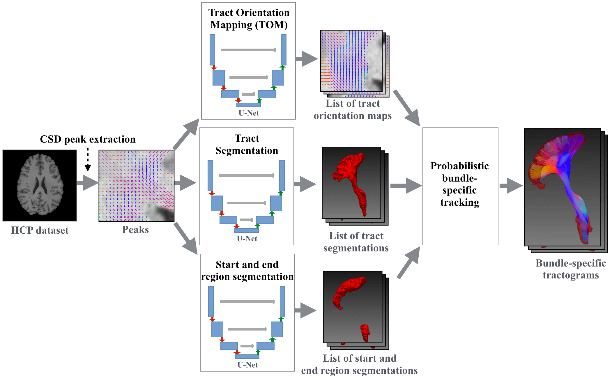

# TractSeg



Tool for fast and accurate white matter bundle segmentation from Diffusion MRI. It can create 
bundle segmentations, segmentations of the endregions of bundles and Tract Orientation Maps (TOMs). Moreover, it can 
do tracking on the TOMs creating bundle-specific tractogram and do Tractometry analysis on those.

The tool works very well for data similar to the Human Connectome Project. For other MRI datasets it works well for all
bundles except for the Commissure Anterior (CA) and the Fornix (FX) which are [incomplete sometimes](#small-bundles-like-the-ca-and-fx-are-incomplete).

TractSeg is the code for the following papers. Please cite the papers if you use it. 
* Tract Segmentation:   
[TractSeg - Fast and accurate white matter tract segmentation](https://doi.org/10.1016/j.neuroimage.2018.07.070) ([free arxiv version](https://arxiv.org/abs/1805.07103))
[NeuroImage 2018]
* Tract Orientation Mapping (TOM):   
[Tract orientation mapping for bundle-specific tractography](https://arxiv.org/abs/1806.05580)
[MICCAI 2018]
* Tracking on TOMs:  
[Combined tract segmentation and orientation mapping for bundle-specific tractography](https://www.sciencedirect.com/science/article/pii/S136184151930101X)
[Medical Image Analysis 2019]
* Tractometry:  
[Multiparametric mapping of white matter microstructure in catatonia](https://www.nature.com/articles/s41386-020-0691-2) ([free preprint](resources/Wasserthal2020_Multiparametric_mapping_of_white_matter.pdf))
[Nature Neuropsychopharmacology 2020]

[](https://brainlife.io/app/5b82d7f4e2f4f800275e020f#)

## Table of contents
* [Install](#install)
* [How to use](#how-to-use)
* [FAQ](#faq)
* [Train your own model](#train-your-own-model)

## Install
TractSeg only runs on Linux and OSX. It works with Python >= 3.6.

#### Install Prerequisites
* [Pytorch](http://pytorch.org/)
* [Mrtrix 3](http://mrtrix.readthedocs.io/en/latest/installation/linux_install.html) (>= 3.0 RC3)
* [FSL](https://fsl.fmrib.ox.ac.uk/fsl/fslwiki/FslInstallation) (if you already have a brain mask and do not use the 
option `--preprocess` this is not needed)

#### Install TractSeg
Latest stable version:
```
pip install TractSeg
```
> NOTE: See [CHANGELOG](CHANGELOG.md) for (breaking) changes of each version  

If you want to use Cython for `Tracking` (speedup 2x) then install via 
```
pip install https://github.com/MIC-DKFZ/TractSeg/archive/cython_tracking.zip
```


#### Docker
You can also directly use TractSeg via Docker (contains all prerequisites).
```
sudo docker run -v /absolute/path/to/my/data/directory:/data \
-t wasserth/tractseg_container:master TractSeg -i /data/my_diffusion_file.nii.gz -o /data --raw_diffusion_input
```
On OSX you might have to increase the Docker memory limit from the default of 2GB to something
like 7GB.

## How to use

#### Simple example:
To segment the bundles on a Diffusion Nifti image run the following command. (Diffusion.bvals and Diffusion.bvecs have to be in the same directory
as the input image.)
(You can use the example image provided in this repository under `examples`.)  
```
TractSeg -i Diffusion.nii.gz --raw_diffusion_input
```
This will create a folder `tractseg_ouput` inside of the same directory as your input file with one binary segmentation nifti image
for each bundle.
 
> NOTE: Your input image should have the same orientation as MNI space. Moreover it should have isotropic 
spacing. See [here](#aligning-image-to-mni-space) for more details.

#### Custom input and output path:
```
TractSeg -i my/path/my_diffusion_image.nii.gz
         -o my/output/directory
         --bvals my/other/path/my.bvals
         --bvecs yet/another/path/my.bvec
         --raw_diffusion_input
```
Use `--help` to see all options.

#### Use existing peaks
To avoid generating the MRtrix CSD peaks every time you `run TractSeg you can also provide them directly by skipping the 
option `--raw_diffusion_input`.
```
TractSeg -i my/path/my_mrtrix_csd_peaks.nii.gz
```

#### Segment bundle start and end regions
Get segmentations of the regions were the bundles start and end (helpful for filtering fibers that do not run
from start until end).
```
TractSeg -i peaks.nii.gz --output_type endings_segmentation
```

#### Create Tract Orientation Maps (TOMs)
For each bundle create a Tract Orientation Map ([Wasserthal et al., Tract orientation mapping for bundle-specific tractography](https://arxiv.org/abs/1806.05580)). 
This gives you one peak per voxel telling you the main orientation of the respective bundle at this voxel. 
Can be used for bundle-specific tracking later on.
```
TractSeg -i peaks.nii.gz --output_type TOM
```
> NOTE: `--output_type tract_segmentation` and `endings_segmentation` has to be run first. Same input and output 
directories have to be used for all commands. 

Peaks and streamlines can be visualized using for example [MITK Diffusion](http://mitk.org/wiki/DiffusionImaging#Downloads).
> NOTE: Peaks have to be flipped along the z-axis to be displayed correctly in MITK.  


#### Create bundle-specific tractograms
Tracks on TOMs and only keeps fibers not leaving the bundle mask and starting and ending in the endpoint regions.
```
TractSeg -i peaks.nii.gz --output_type tract_segmentation
TractSeg -i peaks.nii.gz --output_type endings_segmentation
TractSeg -i peaks.nii.gz --output_type TOM 
Tracking -i peaks.nii.gz --tracking_format tck
```


#### Use bedpostX peaks instead of CSD peaks
TractSeg also works with bedpostX as input. You have to pass `dyads1.nii.gz` as input and TractSeg will automatically
 find all the other necessary bedpostX files (`dyads2_thr0.05.nii.gz` & `dyads3_thr0.05.nii.gz`. `mean_f1-3samples` 
 will be used for scaling the peaks.). This only works if you did not change the default bedpostX file naming.
```
TractSeg -i dyads1.nii.gz
```

#### Show uncertainty map
Create map showing where the method is uncertain about its segmentation (uses monte carlo dropout: https://arxiv.org/abs/1506.02142)
```
TractSeg -i peaks.nii.gz --uncertainty
```

#### Perform Tractometry
See [Documentation of Tractometry](resources/Tractometry_documentation.md).


#### Extended Tutorial
[Best pratices for standard usecases](resources/Tutorial.md).  
(You can also check out the [tutorial from OHBM 2019](https://colab.research.google.com/github/brainhack101/IntroDL/blob/master/notebooks/2019/Wasserthal/TractSegTutorial.ipynb)
[OUTDATED].)

#### Track subset of bundles
You can specify to only track a subset of bundles.
```
Tracking -i peaks.nii.gz --bundles CST_right,CA,IFO_right
```

#### Bundle names
The following list shows the index of each extracted bundle in the output file (if using `--single_output_file`).
```
0: AF_left         (Arcuate fascicle)
1: AF_right
2: ATR_left        (Anterior Thalamic Radiation)
3: ATR_right
4: CA              (Commissure Anterior)
5: CC_1            (Rostrum)
6: CC_2            (Genu)
7: CC_3            (Rostral body (Premotor))
8: CC_4            (Anterior midbody (Primary Motor))
9: CC_5            (Posterior midbody (Primary Somatosensory))
10: CC_6           (Isthmus)
11: CC_7           (Splenium)
12: CG_left        (Cingulum left)
13: CG_right   
14: CST_left       (Corticospinal tract)
15: CST_right 
16: MLF_left       (Middle longitudinal fascicle)
17: MLF_right
18: FPT_left       (Fronto-pontine tract)
19: FPT_right 
20: FX_left        (Fornix)
21: FX_right
22: ICP_left       (Inferior cerebellar peduncle)
23: ICP_right 
24: IFO_left       (Inferior occipito-frontal fascicle) 
25: IFO_right
26: ILF_left       (Inferior longitudinal fascicle) 
27: ILF_right 
28: MCP            (Middle cerebellar peduncle)
29: OR_left        (Optic radiation) 
30: OR_right
31: POPT_left      (Parieto‐occipital pontine)
32: POPT_right 
33: SCP_left       (Superior cerebellar peduncle)
34: SCP_right 
35: SLF_I_left     (Superior longitudinal fascicle I)
36: SLF_I_right 
37: SLF_II_left    (Superior longitudinal fascicle II)
38: SLF_II_right
39: SLF_III_left   (Superior longitudinal fascicle III)
40: SLF_III_right 
41: STR_left       (Superior Thalamic Radiation)
42: STR_right 
43: UF_left        (Uncinate fascicle) 
44: UF_right 
45: CC             (Corpus Callosum - all)
46: T_PREF_left    (Thalamo-prefrontal)
47: T_PREF_right 
48: T_PREM_left    (Thalamo-premotor)
49: T_PREM_right 
50: T_PREC_left    (Thalamo-precentral)
51: T_PREC_right 
52: T_POSTC_left   (Thalamo-postcentral)
53: T_POSTC_right 
54: T_PAR_left     (Thalamo-parietal)
55: T_PAR_right 
56: T_OCC_left     (Thalamo-occipital)
57: T_OCC_right 
58: ST_FO_left     (Striato-fronto-orbital)
59: ST_FO_right 
60: ST_PREF_left   (Striato-prefrontal)
61: ST_PREF_right 
62: ST_PREM_left   (Striato-premotor)
63: ST_PREM_right 
64: ST_PREC_left   (Striato-precentral)
65: ST_PREC_right 
66: ST_POSTC_left  (Striato-postcentral)
67: ST_POSTC_right
68: ST_PAR_left    (Striato-parietal)
69: ST_PAR_right 
70: ST_OCC_left    (Striato-occipital)
71: ST_OCC_right
```

#### Use different tract definitions
TractSeg was also trained on the bundles provided by [XTRACT](https://fsl.fmrib.ox.ac.uk/fsl/fslwiki/XTRACT). 
These bundles are slightly differently defined. They tend to be more specific but therefore also a bit 
less complete. Depending on your application this might be of interest for you. Using TractSeg instead of XTRACT
has the advantage of being at least 10x faster. Please cite XTRACT if you use this. 
> NOTE: This is only supported for output type `tract_segmentation` and `dm_regression`.
```
TractSeg -i peaks.nii.gz --tract_definition xtract
```

#### Use python interface
```python
import nibabel as nib
import numpy as np
from tractseg.python_api import run_tractseg
peaks = nib.load("tests/reference_files/peaks.nii.gz").get_fdata()
segmentation = run_tractseg(peaks)
```

#### Different tracking types
You can use different types of tracking:

* "Probabilistic" tracking on TOM peaks [**default**].    
`Tracking -i peaks.nii.gz`  
Probabilistic means that at each step a small random factor will be added to the direction given by the TOM peaks.
If not doing this on low resolution data it sometimes gets difficult finding fibers running from start to end and
covering the whole bundle.

* Probabilistic tracking on original FODs.
`Tracking -i WM_FODs.nii.gz --track_FODs iFOD2`  
Is calling Mrtrix iFOD2 tracking internally. Does not use TOM peaks but the original FODs. The results will get 
filtered by the bundle mask and have to start and end in the endings masks.


#### Tracking formats
You can use the option `--tracking_format` to define the file format of the streamline files.
`tck` is the most stable tracking format and recommended. `trk` might get displayed differently in different viewers.  
> NOTE: When calling `Tractometry` and `plot_tractometry_results` you have to set the same tracking format as was used in `Tracking`. 


#### Aligning image to MNI space
The input image must have the same "orientation" as the Human Connectome Project data (MNI space) 
(LEFT must be on the same side as LEFT of the HCP data) and have isotropic spacing. 
If the image orientation and the gradient orientation of your data is the same as in `examples/Diffusion.nii.gz`
you are fine. Otherwise you should use `fslreorient2std` or rigidly register your image to MNI space (the brains
do not have to be perfectly aligned but must have the same LEFT/RIGHT orientation).
You can use the following FSL commands to rigidly register you image to MNI space (uses 
the FA to calculate the transformation as this is more stable):
```shell
calc_FA -i Diffusion.nii.gz -o FA.nii.gz --bvals Diffusion.bvals --bvecs Diffusion.bvecs \
--brain_mask nodif_brain_mask.nii.gz

flirt -ref tractseg/tractseg/resources/MNI_FA_template.nii.gz -in FA.nii.gz \
-out FA_MNI.nii.gz -omat FA_2_MNI.mat -dof 6 -cost mutualinfo -searchcost mutualinfo

flirt -ref tractseg/tractseg/resources/MNI_FA_template.nii.gz -in Diffusion.nii.gz \
-out Diffusion_MNI.nii.gz -applyxfm -init FA_2_MNI.mat -dof 6
cp Diffusion.bvals Diffusion_MNI.bvals
rotate_bvecs -i Diffusion.bvecs -t FA_2_MNI.mat -o Diffusion_MNI.bvecs
```
To enforce isotropic spacing you can replace `-applyxfm` by `-applyisoxfm <your_spacing>`.

To move the results back to subject space you can use the following commands:
```shell
convert_xfm -omat MNI_2_FA.mat -inverse FA_2_MNI.mat  # invert transformation

flirt -ref FA.nii.gz -in my_bundle.nii.gz -out my_bundle_subject_space.nii.gz \
-applyxfm -init MNI_2_FA.mat -dof 6 -interp spline  # for TOM maps you have to use the command vecreg

fslmaths my_bundle_subject_space.nii.gz -thr 0.5 -bin my_bundle_subject_space.nii.gz  # float to binary 
```

The option `--preprocess` will automatically rigidly register the input image to MNI space, run TractSeg and then 
convert the output back to subject space. For TOMs and trackings the `--preprocess` option has to be used as 
follows:
```shell
# in first step --raw_diffusion_input has to be used together with --preprocess
TractSeg -i Diffusion.nii.gz -o tractseg_output --output_type tract_segmentation --raw_diffusion_input --preprocess
# -o has to be set in all following steps
TractSeg -i tractseg_output/peaks.nii.gz -o tractseg_output --output_type endings_segmentation --preprocess
TractSeg -i tractseg_output/peaks.nii.gz -o tractseg_output --output_type TOM --preprocess
Tracking -i tractseg_output/peaks.nii.gz -o tractseg_output
```
> NOTE: `--preprocess` does not work if you are using the option `--csd_type csd_msmt_5tt`, 
because the T1 image will not automatically be registered to MNI space

If you are not familiar with preprocessing of DWI images (e.g. correcting for artifacts) you can have a look at 
[this](resources/utility_scripts/dwi_preprocessing.sh) preprocessing script.


## FAQ

#### My output segmentation does not look like any bundle at all!
Make sure your input image is in MNI space. Even if the input image is in MNI space the Mrtrix peaks might still be flipped. 
In those cases you should view the peaks in `mrview` and make sure they have the proper 
orientation. Otherwise you might have to flip the sign along the x, y or z axis using the following command: 
```
flip_peaks -i my_peaks.nii.gz -o my_peaks_flip_y.nii.gz -a y
```

#### My data has anisotropic spacing. Does it still work?
If the spacing is only slightly anisotropic (e.g. 1.9mm x 1.9mm x 2mm) it still works fine. If the spacing is heavily 
anisotropic (e.g. 1mm x 1mm x 2mm) results will be a lot better if you resample your image to isotropic spacing first.

#### Small bundles like the CA and FX are incomplete
You can use the following options to improve your results:  
`--super_resolution` The input image is upsampled to 1.25mm resolution (the resolution TractSeg was trained on) and 
finally downsampled back to the original resolution. Using `--super_resolution` will output the image at 1.25mm. 
Especially if image resolution is low parts of the CA can get lost during downsampling.

#### Can I save the pretrained weights at a different location?
Per default the pretrained weights will be downloaded to and loaded from `~/.tractseg/`. You can change this directory
by adding `weights_dir=/absolute/path_to_where/you_want_it` to `~/.tractseg/config.txt` in a new line (if the file does 
not exist yet you have to create it).  
Normally the pretrained weights will automatically be downloaded in the background right when they are needed. In some
cases you might want to download all of them at once. To do so you can simply run `download_all_pretrained_weights` and 
the weights will be download to `~/.tractseg/` or the location you specified in `~/.tractseg/config.txt`.

#### Did I install the prerequisites correctly?

You can check if you installed Mrtrix correctly if you can run the following command on your terminal:
`dwi2response -help`

You can check if you installed FSL correctly if you can run the following command on your terminal: 
`bet -help`

TractSeg uses these commands so they have to be available.

#### How can I install the latest master branch?
```
pip install https://github.com/MIC-DKFZ/TractSeg/archive/master.zip
```

## Train your own model
TractSeg uses a pretrained model. You can also train your own model on your own data, however TractSeg is not 
optimised to make this convenient, as most people will use the pretrained model. The following 
guide is quite short and you might have problems following every step. Contact the author if
you need help training your own model.

1. Use your own data or download the data from [Zenodo](https://doi.org/10.5281/zenodo.1088277)
2. If you have streamlines you have to transform them to binary masks. 
You can use [this](https://github.com/MIC-DKFZ/TractSeg/blob/master/resources/utility_scripts/trk_2_binary.py) 
script for that. 
(If you want to train a TOM model you have to create peak maps from the streamlines. This can be done 
by using the MITK Diffusion miniapp `MitkFiberDirectionExtraction`. See the following two issues for more 
details: [82](https://github.com/MIC-DKFZ/TractSeg/issues/82), 
[92](https://github.com/MIC-DKFZ/TractSeg/issues/92))
3. Install TractSeg from local source code:
    ```
    git clone https://github.com/MIC-DKFZ/TractSeg.git
    pip install -e TractSeg
    ```
4. Install BatchGenerators: 
    ```
    git clone https://github.com/MIC-DKFZ/batchgenerators.git
    pip intall -e batchgenerators
    ```  
5. The folder structure of your training data should be the following:
    ```
    custom_path/HCP/subject_01/
          '-> mrtrix_peaks.nii.gz       (mrtrix CSD peaks;  shape: [x,y,z,9])
          '-> bundle_masks.nii.gz       (Reference bundle masks; shape: [x,y,z,nr_bundles])
    custom_path/HCP/subject_02/
          ...
    ```  
6. Preprocess the data using `tractseg/data/preprocessing.py` to remove all non-brain area (crop to brain 
bounding box). Adapt the data pathes in `tractseg/data/preprocessing.py` to fit your data (look for `#todo: adapt` 
inside of the file.)
7. Adapt the file `tractseg/config/custom/My_custom_experiment.py`.
8. Create a file `~/.tractseg/config.txt`. This contains the path to your data directory `working_dir=XXX`, e.g.
`working_dir=custom_path`.
9. Adapt `tractseg.data.dataset_specific_utils.get_bundle_names()` with the bundles you use in your reference data.
10. Adapt `tractseg.data.dataset_specific_utils.get_labels_filename()` with the names of your label files.
11. Adapt `tractseg.data.Subjects` with the list of your subject IDs.
12. Run `ExpRunner --config My_custom_experiment` 
13. `custom_path/hcp_exp/My_custom_experiment` contains the results


## Docker
To build a docker container with all dependencies run the following command in project root:
```
sudo docker build -t tractseg_container -f Dockerfile_CPU .
```
> NOTE: With docker the option `--plot3D` of the command `plot_tractometry_results` might not work.

## Copyright
Copyright © German Cancer Research Center (DKFZ), Division of Medical Image Computing (MIC).
Please make sure that your usage of this code is in compliance with the [code license](LICENSE)!

