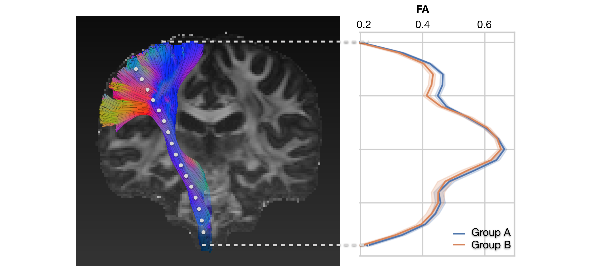
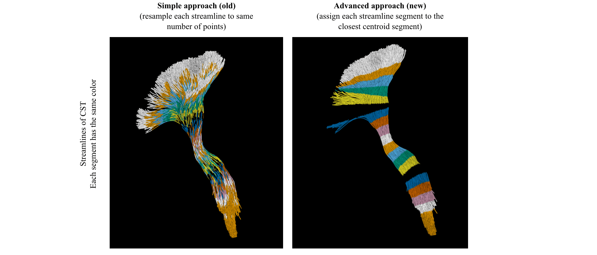
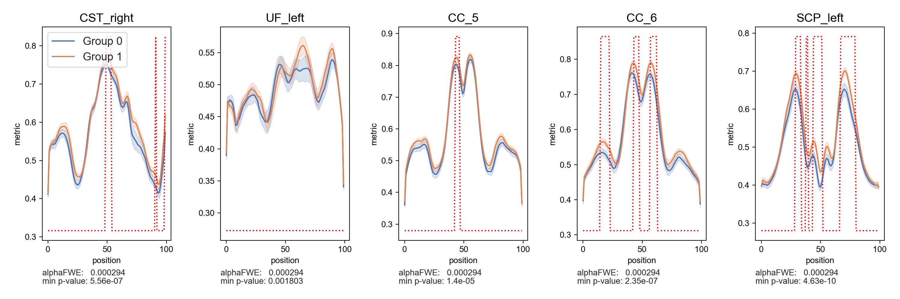
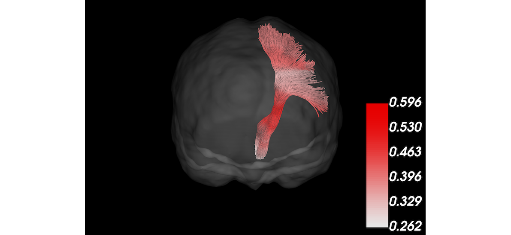

# Tractometry

> **Warning**: Use TractSeg `>= v2.1` because earlier versions contain small bug in Tractometry script (streamlines 
incorrectly shifted by 0.5 voxels).  

Measuring the FA (or MD or other values) along tracts can provide valuable insights (e.g. [Yeatman et al. 2012](https://journals.plos.org/plosone/article?id=10.1371/journal.pone.0049790)).
In our implementation of Tractometry we do the following:
1. Resample all streamlines to an equal number of segments/points
2. Find the centroid of all streamlines
3. For each streamline assign each segment to the closest centroid segment
4. Evaluate the FA (or any other metric) at each segment of each streamline
5. For each centroid segment average the FA for all assigned streamline segments  

This approach is based on the Bundle Analytics paper from 
[Chandio et al](https://www.nature.com/articles/s41598-020-74054-4). Please cite their work if you
use this.

An easier approach (which we used previously in TractSeg) would be to evaluate the FA along 20 equality distant 
points along each streamline. Then take the mean for each of those 20 points over all streamlines. However, this 
leads to more blurring of the segments as can be seen in the following figure:

Run the following steps:
1. Go to the folder where you have your `Diffusion.nii.gz`, `Diffusion.bvals`, `Diffusion.bvecs` and `FA.nii.gz` files. 
They should rigidly be aligned to [MNI space](https://github.com/MIC-DKFZ/TractSeg#aligning-image-to-mni-space) and 
already be preprocessed (motion and distortion correction, ...). If they are not rigidly aligned to MNI space results might be significantly worse!
2. Create segmentation of bundles:  
`TractSeg -i Diffusion.nii.gz -o tractseg_output --raw_diffusion_input --output_type tract_segmentation` (runtime on 
GPU: 2min ~14s)  
> NOTE: if you already have the MRtrix CSD peaks you can also pass those as input and remove the option `--raw_diffusion_input`
3. Create segmentation of start and end regions of bundles:  
`TractSeg -i tractseg_output/peaks.nii.gz -o tractseg_output --output_type endings_segmentation` (runtime on GPU: ~42s)
4. Create Tract Orientation Maps and use them to do bundle-specific tracking:  
`TractSeg -i tractseg_output/peaks.nii.gz -o tractseg_output --output_type TOM` (runtime on GPU: ~1min 30s)  
`Tracking -i tractseg_output/peaks.nii.gz -o tractseg_output --nr_fibers 5000 --tracking_format tck` (runtime on CPU: ~12min)  
 > NOTE: As the streamline seeding is random, results will be slightly different everytime you run it. 
 A high number of streamlines like 5000 will lower this variation.  
 > NOTE: `tck` is the most stable tracking format. `trk` might get displayed differently in different viewers.
5. Run tractometry:  
`cd tractseg_output`  
`Tractometry -i TOM_trackings/ -o Tractometry_subject1.csv -e endings_segmentations/ -s ../FA.nii.gz --tracking_format tck` (runtime on CPU: ~20s)  
> NOTE: if you set the option `--tracking_format` for `Tracking` you also have to set it for `Tractometry` and `plot_tractometry_results`.
6. Repeat step 1-4 for every subject (use a shell script for that)
7. To test for statistical significance and plot the results run the following command:  
`plot_tractometry_results -i tractseg/examples/subjects.txt -o tractometry_result.png --mc --tracking_format tck`
(runtime on CPU for group analysis: ~4min for 100 subjects)  
(runtime on CPU for correlation analysis: ~7min for 40 subjects)
Adapt `subjects.txt` with your data path, subject IDs and confounds. `tractseg/examples/subjects.txt` contains more 
information on how to do this.
8. The results will look similar to the following:

      

    The y-axis ("metric") shows the mean FA (or the metric you used in Tractometry) for each group. The shadded area around the line is the 95% confidence interval generated by [seaborn lineplot](https://seaborn.pydata.org/generated/seaborn.lineplot.html).  
    `alphaFWE` is the alpha value corrected for multiple comparison (multiple positions per bundle and multiple bundles).  
    `min p-value` is the minimal p-value which was calculated for each bundle (minimum over all 100 positions).  
    So if `min p-value`<`alphaFWE` this bundle contains significant results. The red dotted line 
    indicates all positions within the bundle where `p-value`<`alphaFWE`.  
    The statistical analysis is based on the statistical analysis from 
    [Yeatman et al. (2012)](https://journals.plos.org/plosone/article?id=10.1371/journal.pone.0049790). Please cite their 
    work if you use this.

9. Optionally the argument `--plot3D metric` can be added when calling `plot_tractometry_results`. This will generated 3D 
plots of the streamlines of each bundle. The coloring indicates the average FA (or any other metric used for 
Tractometry) for each segment (100 segments per default) across all subjects. For this to work `# plot_3D=...` has to
 be added to the `subjects.txt` file (see `tractseg/examples/subjects.txt` for more details.)
(`--plot3D` is only available in the master branch, not v2.1.1)

  

> **NOTE**: Tractometry is not done for the following bundles, as the geometry of these bundles makes it difficult to 
produce consistent segments:
`MLF, CC, T_PREF, T_PREC, T_POSTC, ST_PREF, ST_PREC, ST_POSTC, ST_PAR, ST_OCC`  
Tractometry is also not done for the following bundles as they are incomplete in some cases: `CA, FX`

### Further options   
Instead of analysing the FA along the tracts you can also analyze the peak length along the tracts. 
This has one major advantage: The peaks are generated using Constrained Spherical Deconvolution (CSD) 
which can handle crossing fibers in contrast to FA which can not. How does TractSeg analyze the peak 
length along a certain tract:
CSD gives us up to three peaks per voxel (all further ones are discarded). 
Now TractSeg selects the peak which is most similar to the direction of the bundle at that voxel 
(= peak with the lowest angular error to the peak from the Tract Orientation Map for that bundle). 
The length of that peak is then analyzed.  
> **IMPORTANT NOTE**: The peak length depends on the response function which will be different for each subject.
Therefore results will not be comparable between subjects. To solve this you have to use the same response function
for all subjects when calculating the CSD. Moreover, you should use bias field correction and intensity normalisation. 
Those steps are documented in detail 
[here](https://mrtrix.readthedocs.io/en/latest/fixel_based_analysis/st_fibre_density_cross-section.html).
You have to make yourself familiar with this before you use it. (some more information can also be found 
[here](https://github.com/MIC-DKFZ/TractSeg/issues/42))

`Tractometry -i TOM_trackings/ -o Tractometry_subject1.csv -e endings_segmentations/ -s peaks.nii.gz --TOM TOM --peak_length`